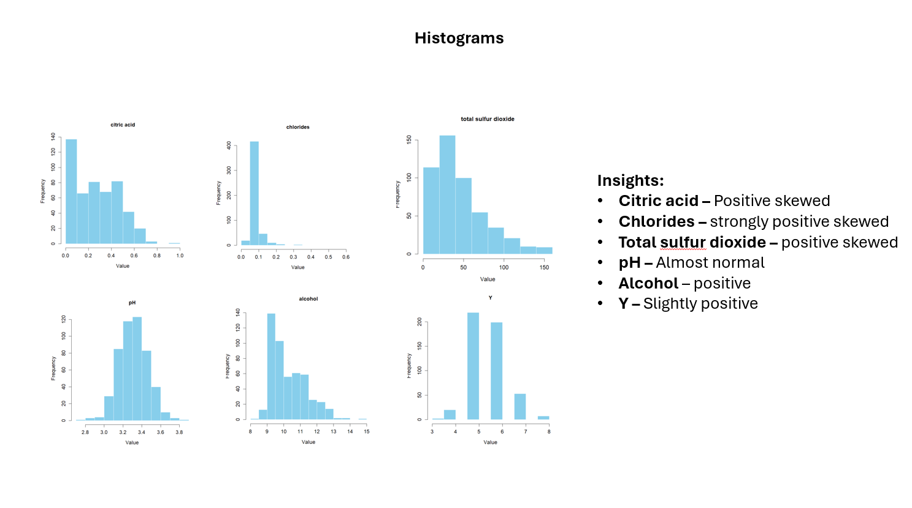
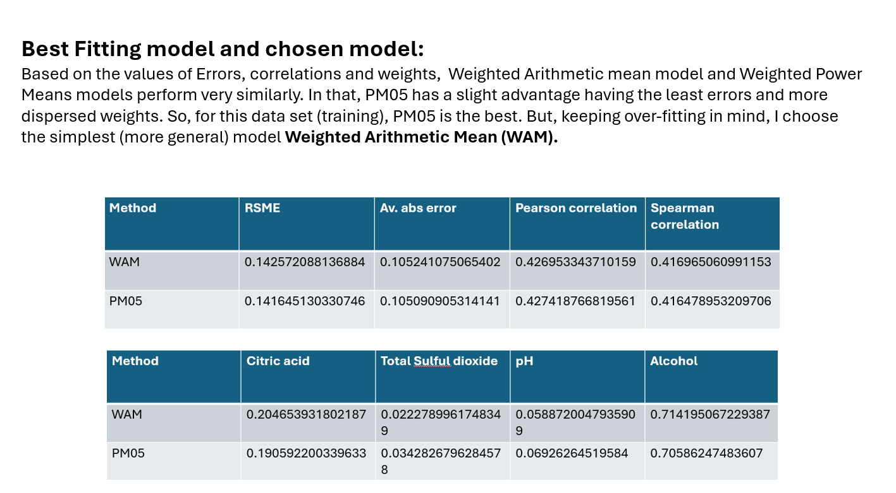

# 🍷 Predicting Wine Quality Using Aggregation Functions  

Welcome to my **Analytics Project**! This project involves analyzing the Red Wine Quality dataset to predict wine quality scores based on physicochemical properties. It highlights data visualization, transformation, and model building techniques using R.

## 🌟 Highlights  

- **📊 Data Visualization**: Explored relationships between variables using scatterplots and histograms.  
- **🔄 Data Transformation**: Performed skewness-based transformations, Min-Max normalization, and Z-score standardization.  
- **⚖️ Model Building**: Compared Weighted Arithmetic Mean, Power Mean, and Ordered Weighted Average models.  
- **🎯 Predictions**: Predicted wine quality for new data and validated it with the best-fit model.  
 

## 📚 The Dataset  

The dataset contains **1,599 red wine samples** with physicochemical properties and quality scores (0–10).  

**Features**:  
- `Citric Acid` (X1): Indicator of acidity.  
- `Chlorides` (X2): Salt concentration.  
- `Total Sulfur Dioxide` (X3): Preservative content.  
- `pH` (X4): Acidity level.  
- `Alcohol` (X5): Alcohol content.  
- `Quality` (Y): Score assigned by tasters.  

## 🔬 Analytical Insights  

### **1️⃣ Understanding the Data**  
- Created scatterplots and histograms to identify patterns and distributions.  
- Observations:  
  - `Alcohol` shows a positive relationship with quality.  
  - Most variables are positively skewed; `pH` is nearly normal.  

### **2️⃣ Data Transformation**  
- Skewness values guided transformations:  
  - Positive skew: Square root or log transformation.  
  - Negative skew: P-square transformation.  
- Applied Min-Max normalization and Z-score standardization for scaling.  

### **3️⃣ Model Building and Comparison**  
Evaluated models using transformed data:  
- **Weighted Arithmetic Mean (WAM)**  
- **Power Mean (P=0.5 and P=2)**  
- **Ordered Weighted Average (OWA)**  

**Metrics for Comparison**:  
- RMSE, Absolute Error, Pearson/Spearman Correlations.  
- Key Insight:  
  - WAM and Power Mean (P=0.5) performed similarly.  
  - WAM chosen for simplicity and robustness.  

### **4️⃣ Predictions**  
- Predicted wine quality for input:  
  - Citric Acid: `0.9`, Total Sulfur Dioxide: `38`, pH: `2.53`, Alcohol: `7.1`.  
- Predicted Quality: **5**  
- Reasonable prediction based on feature importance (`Alcohol` and `Citric Acid` ~90%).  

## 📈 Visualizations  

Key plots illustrating relationships and transformations:  
- Scatterplots showing variable vs. quality relationships.  
- Histograms depicting raw and transformed distributions.  

## 📸 Screenshots  

Take a glimpse of the work:  

  
  
 

## Demo Video

Click below to see how it works

## 📬 Contact  

For inquiries or collaboration, reach out at [sathiyanarayanan.s1698@gmail.com](mailto:sathiyanarayanan.s1698@gmail.com).  

---  

If you found this project insightful, please ⭐ star the repository. Let's connect and explore more about data science and analytics!  
